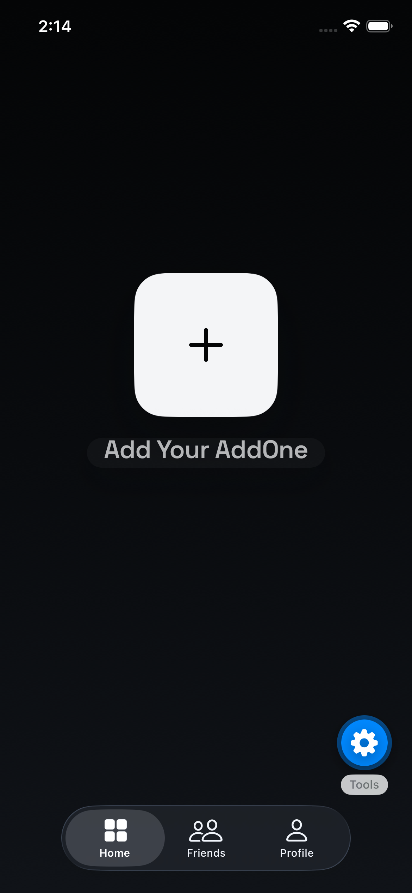
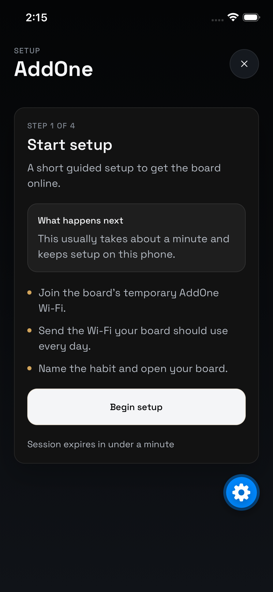

Stage
S3: Beta UI Completion And Social Shape

Status
Implemented. The no-owned-device Home state now uses a single centered plus tile with a crisp external `Add Your AddOne` label and no blur-based text treatment. The label was refined against Apple-style material guidance to use subtle fill and depth rather than frosted blur, so it stays readable on the dark Home shell. Manual simulator proof is captured. `npm run typecheck` is still blocked locally by the duplicate `react 2` / `@types/react 2` install artifact.

Changes made
- Rebuilt the no-device Home empty state in `components/app/home-screen.tsx` from scratch as one large centered high-contrast plus button with the CTA text placed outside the button.
- Removed the earlier glow, motion, split-highlight, and text-inside-button iterations so the screen now relies on one obvious action and one clean label only.
- Replaced the blurry glass label with a sharper low-profile title treatment that uses subtle fill and shadow instead of blur, which keeps the text legible while still feeling native to the rest of the shell.
- Kept the button simple and bright against the dark shell so it reads immediately as the first setup move.
- Kept the existing onboarding handoff by leaving the action wired to `router.push("/onboarding")`.
- Added a durable UI issue-log note locking this empty state as a minimal single-action onboarding entry surface.
- Exact files changed:
  - `components/app/home-screen.tsx`
  - `Docs/ui-beta-issue-log.md`
  - `Docs/agent-reports/2026-03-21-s3-add-device-entry-flow-first-screen.md`
  - `Docs/agent-reports/assets/2026-03-21-s3-add-device-entry-home-empty-state.png`
  - `Docs/agent-reports/assets/2026-03-21-s3-add-device-entry-onboarding-route-check.png`

Commands run
```text
sed -n '1,220p' .agents/skills/building-native-ui/SKILL.md
sed -n '1,240p' .agents/skills/building-native-ui/references/visual-effects.md
sed -n '1,240p' .agents/skills/building-native-ui/references/icons.md
sed -n '1,220p' Docs/AddOne_Main_Plan.md
sed -n '1,220p' Docs/project-memory.md
sed -n '1,220p' Docs/git-operations.md
sed -n '1,220p' Docs/agent-coordination.md
sed -n '1,220p' Docs/stages/stage-register.md
sed -n '1,260p' Docs/stages/stage-03-trusted-beta-surface-alignment.md
sed -n '1,220p' Docs/tasks/T-008-onboarding-and-wifi-recovery-polish.md
sed -n '1,220p' Docs/tasks/T-017-add-device-entry-flow-first-screen.md
sed -n '1,220p' Docs/ui-beta-issue-log.md
sed -n '1,260p' Docs/AddOne_V1_Canonical_Spec.md
sed -n '1,240p' app/\(app\)/onboarding/index.tsx
sed -n '1,220p' app/sign-in.tsx
sed -n '1,220p' components/ui/glass-card.tsx
sed -n '1,220p' components/layout/screen-frame.tsx
npx expo start --clear --port 8116 --host lan
xcrun simctl terminate booted host.exp.Exponent
xcrun simctl launch booted host.exp.Exponent
xcrun simctl openurl booted 'exp://192.168.1.183:8116/--/'
xcrun simctl io booted screenshot Docs/agent-reports/assets/2026-03-21-s3-add-device-entry-home-empty-state.png
xcrun simctl openurl booted 'exp://192.168.1.183:8116/--/onboarding'
xcrun simctl io booted screenshot Docs/agent-reports/assets/2026-03-21-s3-add-device-entry-onboarding-route-check.png
npm run typecheck
```

Evidence
- Manual simulator proof of the current Home empty state is captured below.



- The existing onboarding route still opens in the simulator and is captured below.



- `npm run typecheck` failed before checking this screen because the local install still contains duplicate type/package folders:
  - `node_modules/react 2`
  - `node_modules/@types/react 2`
- Exact typecheck error:

```text
error TS2688: Cannot find type definition file for 'react 2'.
  The file is in the program because:
    Entry point for implicit type library 'react 2'
```

Open risks / blockers
- `npm run typecheck` remains blocked by the local duplicate install artifact above, so this pass does not yet have clean typecheck proof.
- The onboarding-route evidence is a direct simulator route check. I did not automate a physical tap event inside the simulator tooling, but the Home button still routes with `router.push("/onboarding")`.

Recommendation
Use this reset as the new baseline for `T-017`. The screen now behaves like a deliberate first introduction instead of a decorative icon experiment. If you want to iterate further, the next sensible pass is only proportional tuning of the button's size, radius, or label spacing, not a return to blur, copy blocks, or motion variants.
